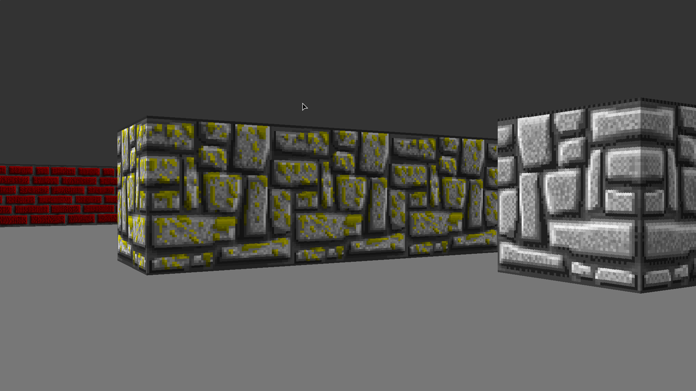

# Vargenssten 3D

[](https://github.com/claudemuller/vargenssten3d.c/actions/workflows/c.yml)



A [Ray casting](https://en.wikipedia.org/wiki/Ray_casting) game based off of [Wolfenstein 3D](https://en.wikipedia.org/wiki/Wolfenstein_3D) written in C SDL.

## Requirements

- [gcc](https://gcc.gnu.org/)
- or [clang](https://clang.llvm.org/)
- [make](https://www.gnu.org/software/make/)
- [SDL2](https://www.libsdl.org/)
- (Optional) [Bear](https://github.com/rizsotto/Bear) - for auto-completion (in the editor)

## Generate Compilation Database (for auto-completion)

```bash
make gen-compilation-db
```

## Building

```bash
make build
```

## Running

```bash
make run
```

## Build a Debug Binary

```bash
make debug-build
```

## Start `lldb` or `gdb` With Debug Binary

```bash
make debug
```

## Cleaning the Project

```bash
make clean
```
